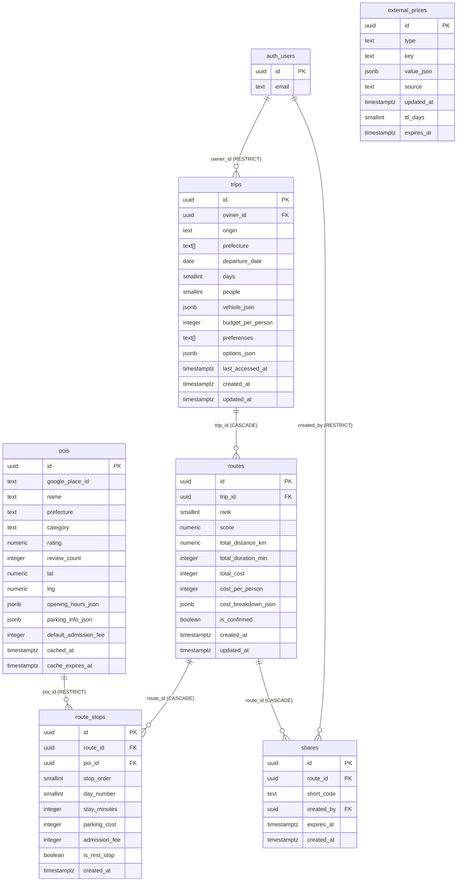

# Carrip ER図

**プロジェクト名：** Carrip（カーリップ）  
**対象DB：** Supabase（PostgreSQL）

## リレーション一覧

| 親テーブル | 子テーブル | FK カラム | ON DELETE |
|-----------|-----------|----------|-----------|
| auth_users | trips | owner_id | RESTRICT |
| auth_users | shares | created_by | RESTRICT |
| trips | routes | trip_id | CASCADE |
| routes | route_stops | route_id | CASCADE |
| routes | shares | route_id | CASCADE |
| pois | route_stops | poi_id | RESTRICT |

## 備考

- `external_prices` は他テーブルとの外部キー関係なしの独立テーブル
- `auth_users` は Supabase Auth が管理するため直接 DDL 不要
