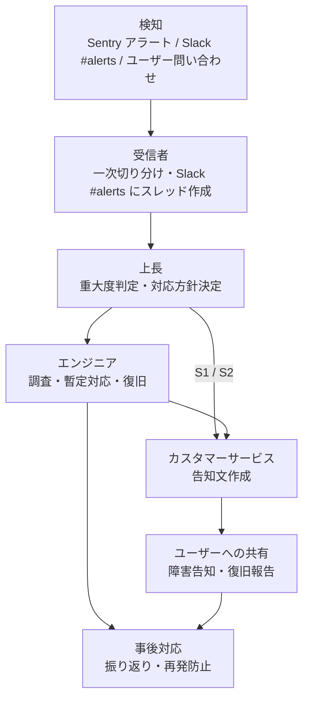

# Carrip 障害対応・エスカレーションフロー

**プロジェクト名：** Carrip（カーリップ）  
**関連ドキュメント：** [要件定義書 5-2 可用性・信頼性要件 / 5-5 運用・保守要件 / 13 保守・運用計画](./requirements.md)、[エラーカタログ](../document/エラーカタログ_DriveRoute.md)

障害が発生したときに、全員が同じ手順で対応するためのドキュメントです。  
エスカレーションの順番は要件定義書「13. 保守・運用計画」で決めた **受信者 → 上長 → エンジニア → カスタマーサービス → ユーザーへの共有** に従います。

---

## 1. 役割と担当者

| 役割 | 担当者 | 主な責任 |
|---|---|---|
| 受信者 | 柳田（アラート受信メール） / Slack `#alerts` を見た人 | アラート・問い合わせを最初に受け取り、一次切り分けをして上長に報告する |
| 上長 | （担当者を記入） | 重大度を判定し、対応方針（エンジニアのアサイン、ユーザー告知の要否）を決める |
| エンジニア | （担当者を記入） | 原因調査・暫定対応・恒久対応を行い、復旧を確認する |
| カスタマーサービス | （担当者を記入） | ユーザー向けの告知文を作成し、問い合わせに対応する |

> 担当者が不在の場合は、次の役割の人がその役割を代行します（例：上長不在時はエンジニアが重大度を判定）。

---

## 2. エスカレーションフロー



### 各ステップでやること

| # | 担当 | やること | 期限の目安 |
|---|---|---|---|
| 1 | 受信者 | アラート内容・発生時刻・影響範囲（どの画面 / API か）を確認し、Slack `#alerts` に障害スレッドを作成する | 検知から 15 分以内 |
| 2 | 上長 | 「3. 重大度の判定」に従って S1〜S3 を決め、エンジニアをアサインする | 報告から 15 分以内 |
| 3 | エンジニア | 原因を調査し、暫定対応（ロールバック・機能停止・フォールバック確認など）で復旧させる | S1：4 時間以内（RTO） |
| 4 | カスタマーサービス | ユーザー告知が必要な場合、告知文を作成して上長の確認後に公開する | S1：判定から 30 分以内 |
| 5 | カスタマーサービス | 復旧後に復旧報告を公開する | 復旧確認後すみやかに |
| 6 | エンジニア・上長 | 「6. 事後対応」に従って振り返りを行い、再発防止策を GitHub Issue にする | 復旧から 1 週間以内 |

---

## 3. 重大度の判定

| 重大度 | 基準 | 例 | ユーザー告知 |
|---|---|---|---|
| **S1（緊急）** | サービス全体が使えない、またはデータ消失・情報漏えいのおそれがある | 全ページが 500 エラー（DR-SYS-002）、DB 接続不可（DR-SYS-003）、不正アクセスの急増（DR-AUTH-002） | 必要 |
| **S2（重要）** | 主要機能が使えないが、回避策がある / 一部ユーザーのみ影響 | ルート生成がタイムアウトし続ける（DR-RTE-003）、LINE 共有が失敗する、API 課金上限到達（DR-EXT-005） | 必要 |
| **S3（軽微）** | フォールバックで動作しており、ユーザー影響が小さい | 外部 API の劣化で概算表示になっている（DR-EXT-001/002）、AI コメントが空欄 | 不要（状況に応じて） |

> 目標値：MVP の月間稼働率 99.0%、RTO（目標復旧時間）4 時間以内、RPO（目標復旧時点）24 時間以内（要件定義書 5-2）。

---

## 4. 検知の経路

| 経路 | 条件 | 通知先 |
|---|---|---|
| Sentry | エラー率 1% 超 | Slack `#alerts` |
| Sentry | DR-SYS-002/003 が 5 分以内に 3 件以上 | Slack `#alerts` |
| Sentry | DR-AUTH-002 が 1 時間以内に 20 件以上 | Slack `#alerts` |
| Sentry | DR-EXT-005（API 課金上限） | Slack `#alerts` + メール |
| Sentry | DR-EXT-001/002 が 1 時間以内に 10 件以上 / DR-RTE-003 が 1 時間以内に 5 件以上 | Slack `#alerts` / `#dev` |
| Vercel Analytics | p95 > 30 秒 | 通知 |
| Google Cloud Billing | $150/月 超 | 通知 |
| ユーザー問い合わせ | — | カスタマーサービス → 受信者として扱う |

詳細な条件はエラーカタログ「7. エラー監視・アラート設定（Sentry）」を参照してください。

---

## 5. 連絡テンプレート

### 5-1. 受信者 → 上長（Slack `#alerts` スレッド）

```text
【障害報告】<概要>
- 検知時刻：YYYY-MM-DD HH:MM
- 検知経路：Sentry / ユーザー問い合わせ / その他
- 影響範囲：<画面・API・ユーザー数の目安>
- エラーコード / エラーID：<例：DR-SYS-002-abc123>
- Sentry / ログのリンク：<URL>
- 現在の状況：調査前 / 再現確認済み など
```

### 5-2. ユーザー告知（障害発生時）

```text
【障害のお知らせ】
現在、Carrip の<機能名>がご利用しづらい状態になっています。
- 発生日時：YYYY-MM-DD HH:MM ごろ
- 影響：<例：ルートの作成ができない>
- 状況：復旧に向けて対応中です
ご不便をおかけし申し訳ございません。復旧しだい、あらためてお知らせします。
```

### 5-3. ユーザー告知（復旧時）

```text
【復旧のお知らせ】
YYYY-MM-DD HH:MM ごろから発生していた<機能名>の障害は、HH:MM に復旧しました。
ご不便をおかけし申し訳ございませんでした。
```

---

## 6. 事後対応

復旧後 1 週間以内に、障害スレッドの内容をもとに振り返りを行います。

- 発生から復旧までの時系列（検知・判定・暫定対応・復旧の各時刻）
- 原因（直接原因・根本原因）
- 影響（期間・影響ユーザー数・データへの影響の有無）
- うまくいったこと / 改善すべきこと
- 再発防止策 → GitHub Issue を作成し、プロジェクトボードに追加する

---

## 7. 周知方法

- このドキュメントの PR をチーム全員にレビュー依頼し、全員の確認をもって周知完了とする
- 新しいメンバーが加わったときは、このドキュメントを共有する
- 担当者（「1. 役割と担当者」）が変わったときは、このドキュメントを更新する
